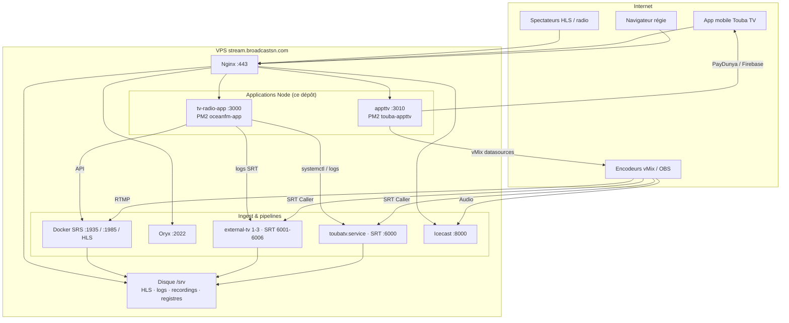

# Global Media Streaming — Broadcast SN

Plateforme de régie live sur VPS unique : streaming vidéo (Touba TV, External TV 1-3),
radio (Ocean FM), dashboard d'exploitation (Stream Control Center) et application
de dédicaces (appttv, PayDunya + vMix).

**Domaine public :** https://stream.broadcastsn.com

---

## Sommaire

1. [Vue d'ensemble](#1-vue-densemble)
2. [Architecture](#2-architecture)
3. [Structure du dépôt](#3-structure-du-dépôt)
4. [Les trois sous-projets](#4-les-trois-sous-projets)
5. [Pipelines vidéo & radio](#5-pipelines-vidéo--radio)
6. [Ports & services (VPS)](#6-ports--services-vps)
7. [Déploiement](#7-déploiement)
8. [CI](#8-ci)
9. [Secrets & sécurité](#9-secrets--sécurité)
10. [Dépannage](#10-dépannage)
11. [Documentation complémentaire](#11-documentation-complémentaire)

---

## 1. Vue d'ensemble

| Bloc | Rôle | Dossier / process |
|------|------|--------------------|
| **Stream Control Center** | Dashboard d'exploitation (flux, monitoring, trafic, enregistrements) | [`tv-radio-app/`](tv-radio-app/) · PM2 `oceanfm-app` · `127.0.0.1:3000` |
| **appttv** | Admin dédicaces, sources vMix XML/JSON/Excel, PayDunya | [`appttv/`](appttv/) · PM2 `touba-appttv` · `127.0.0.1:3010` |
| **global-media-streaming** | Scripts d'installation et de configuration d'infra (Icecast, Nginx, systemd, SRT) | [`global-media-streaming/`](global-media-streaming/) |
| SRS + Oryx | Ingest RTMP → HLS, API, console management | Docker (`srs`, `oryx`) — non versionné ici, voir §11 |
| systemd + FFmpeg / `srt-live-transmit` | Pipelines Touba TV, External TV, RTMP push | unités systemd sur le VPS, scripts sous [`global-media-streaming/services/`](global-media-streaming/services/) |
| Icecast | Radio Ocean FM | `icecast2.service` sur le VPS |
| Nginx | HTTPS, HLS statique, reverse-proxy | conf de référence sous [`global-media-streaming/config/`](global-media-streaming/config/) |

**Marques / chaînes :** Broadcast SN · Touba TV · Ocean FM · External TV (1–3).

---

## 2. Architecture



**Principe SRT :** le serveur est toujours **Listener**, l'encodeur (vMix/OBS) est
toujours **Caller**. Voir [§10](#10-dépannage) pour le détail des réglages et le
dépannage des connexions instables.

---

## 3. Structure du dépôt

```text
globalmediastream/
├── tv-radio-app/              # Stream Control Center — Next.js 16 (App Router)
│   ├── app/                   # Pages + routes API
│   ├── components/
│   ├── lib/                   # auth, traffic, safe-shell, recordings…
│   └── docs/                  # OPS.md, AUDIT_STREAM_CONTROL_CENTER.md, SRT_TROUBLESHOOTING.md
├── appttv/                    # Admin dédicaces Touba TV — Express 5 + TypeScript
│   ├── src/ · dist/ · public/
│   └── deploy/                # audits & rapports de déploiement
└── global-media-streaming/    # Scripts & config d'infrastructure
    ├── config/                # nginx, icecast (templates — secrets en placeholder)
    ├── scripts/                # installation (base_setup, icecast, toubatv…)
    ├── services/               # copies versionnées des scripts SRT live (/usr/local/bin)
    └── tools/                  # utilitaires (SSL, tests SRT, décodeur studio…)
```

Chaque dossier correspond à son propre déploiement en production sur le VPS
(`/srv/tv-radio-app`, `/opt/toubatv/appttv`, `/srv/global-media-streaming`) et
reste synchronisable indépendamment via `git subtree`.

---

## 4. Les trois sous-projets

### `tv-radio-app/` — Stream Control Center

Dashboard Next.js 16 (App Router) qui centralise l'exploitation : statut des flux
(LIVE / DEGRADED / OFFLINE / REC), trafic & KPI, enregistrements, contrôle SRT/RTMP/
Icecast, monitoring système. Auth par cookie JWT httpOnly + rate-limit login. Seul
point d'accès shell autorisé : `lib/safe-shell.ts`.

→ Détails : [`tv-radio-app/docs/OPS.md`](tv-radio-app/docs/OPS.md) ·
[`tv-radio-app/docs/AUDIT_STREAM_CONTROL_CENTER.md`](tv-radio-app/docs/AUDIT_STREAM_CONTROL_CENTER.md) ·
[`tv-radio-app/docs/SRT_TROUBLESHOOTING.md`](tv-radio-app/docs/SRT_TROUBLESHOOTING.md)

```bash
cd tv-radio-app
npm install
npm run dev      # développement
npm test         # vitest
npm run lint      # eslint (Next 16 + React Compiler rules)
npm run build
```

### `appttv/` — Dédicaces Touba TV

Application Express 5 / TypeScript pour la modération et diffusion des dédicaces
(app mobile → Firebase → modération → vMix). Paiements PayDunya en live, sources
vMix au format XML/JSON/Excel.

→ Détails : [`appttv/README.md`](appttv/README.md)

```bash
cd appttv
cp .env.example .env   # à compléter (Firebase, PayDunya, vMix)
npm install
npm run build
```

### `global-media-streaming/` — Scripts d'infrastructure

Scripts d'installation (Icecast, base système, Touba TV), configurations de
référence (Nginx, Icecast) et copies versionnées des scripts SRT réellement
exécutés en production par systemd (`services/`).

**Note** : les fichiers de `config/` contiennent des placeholders `CHANGE_ME_*`
à la place des vrais secrets — les valeurs réelles vivent uniquement dans les
fichiers système non versionnés (`/etc/icecast2/icecast.xml`, etc.).

---

## 5. Pipelines vidéo & radio

### Touba TV

```text
Encodeur (SRT Caller) → :6000 (listener) → toubatv.service (FFmpeg)
  → HLS disque → Nginx /toubatv/index.m3u8
  → optionnel : push RTMP vers un serveur distant
```

### External TV 1 / 2 / 3

```text
Encodeur (SRT Caller) → :6001 | :6003 | :6005 (listener in)
  → srt-live-transmit (relay pur, pas de ré-encodage)
  → :6002 | :6004 | :6006 (listener out — consommé par un lecteur Caller)
```

### Radio Ocean FM

```text
Source audio → oceanfm-processor (traitement) → Icecast → Nginx /oceanfm
```

### RTMP (SRS)

```text
Encodeur (RTMP) → :1935 → SRS → HLS → Nginx /live/ · /dakar/
```

---

## 6. Ports & services (VPS)

| Port | Proto | Bind | Usage |
|------|-------|------|--------|
| 80 / 443 | TCP | public | Nginx HTTPS |
| 3000 | TCP | `127.0.0.1` | Stream Control Center |
| 3010 | TCP | `127.0.0.1` | appttv |
| 1935 | TCP | public | SRS — publish RTMP |
| 1985 | TCP | `127.0.0.1` | API HTTP SRS |
| 2022 | TCP | `127.0.0.1` | Oryx (proxifié `/mgmt/`) |
| 6000 | UDP | public | Touba TV — SRT in |
| 6001–6006 | UDP | public | External TV 1-3 — SRT in/out |
| 8000 / 8001 | TCP | public | Icecast — listeners / source |

Services systemd : `toubatv`, `toubatv-rtmp-push`, `external-tv`, `external-tv-2`,
`external-tv-3`, `oceanfm-processor`, `icecast2`. PM2 : `oceanfm-app`, `touba-appttv`.

---

## 7. Déploiement

### Stream Control Center

```bash
cd /srv/tv-radio-app && npm run deploy   # = build + pm2 restart oceanfm-app --update-env
pm2 status oceanfm-app
```

> Piège connu : remplacer `.next` sans redémarrer PM2 casse les chunks
> `/_next/static` (erreurs 500 sur le login).

### appttv

```bash
cd /opt/toubatv/appttv && npm run build && pm2 restart touba-appttv --update-env
curl -sS http://127.0.0.1:3010/appttv/health
```

### Pipelines SRT / Nginx

```bash
sudo nginx -t && sudo systemctl reload nginx
sudo systemctl restart toubatv.service   # exemple, un service à la fois
```

---

## 8. CI

Un workflow GitHub Actions ([`.github/workflows/ci.yml`](.github/workflows/ci.yml))
exécute lint, tests (`vitest`) et build sur `tv-radio-app/` à chaque push ou pull
request touchant ce dossier.

---

## 9. Secrets & sécurité

- **Aucun `.env` réel n'est versionné** — seuls les `.env.example` de chaque
  dossier documentent les variables requises.
- Les configurations de référence sous `global-media-streaming/config/`
  utilisent des placeholders `CHANGE_ME_*` à la place des vrais mots de passe.
- Les apps Node ne sont jamais exposées directement : elles bindent en
  `127.0.0.1`, Nginx termine le TLS et fait reverse-proxy.
- Stream Control Center : cookie JWT httpOnly, rate-limit sur le login, seul
  `lib/safe-shell.ts` est autorisé à exécuter des commandes shell.
- Avant de commiter, vérifier `git status` pour s'assurer qu'aucun fichier de
  secrets (`.env`, `service-account.json`, clés) n'est resté suivi.

---

## 10. Dépannage

| Symptôme | Action |
|----------|--------|
| Login / chunks Next 500 | `npm run deploy` + hard refresh navigateur |
| External TV sans image | Vérifier le port UDP côté encodeur, logs `srt-relay.log` ; `SENDING=0` sur l'out = pas de lecteur connecté |
| Touba TV HLS 404 | `systemctl status toubatv` · `/srv/toubatv/hls/` · `ffmpeg.log` |
| **Freezes image / connexion instable (Afrique, 4G)** | Voir [`tv-radio-app/docs/SRT_TROUBLESHOOTING.md`](tv-radio-app/docs/SRT_TROUBLESHOOTING.md) — réglages encodeur vMix/OBS, diagnostic en direct, options d'escalade |
| PayDunya `configured:false` | Vérifier les clés `.env` d'appttv + redémarrer PM2 |

### Santé rapide (sur le VPS)

```bash
pm2 status
systemctl is-active toubatv external-tv external-tv-2 external-tv-3 icecast2
curl -I https://stream.broadcastsn.com/login
curl -sS http://127.0.0.1:3010/appttv/health
ss -ulnp | grep -E '600[0-6]'
df -h /srv
```

---

## 11. Documentation complémentaire

| Document | Contenu |
|----------|---------|
| [`tv-radio-app/docs/OPS.md`](tv-radio-app/docs/OPS.md) | Exploitation Next.js — auth, variables d'env, déploiement |
| [`tv-radio-app/docs/AUDIT_STREAM_CONTROL_CENTER.md`](tv-radio-app/docs/AUDIT_STREAM_CONTROL_CENTER.md) | Audit sécurité/qualité SCC — 30 points corrigés (lots 1-11) |
| [`tv-radio-app/docs/SRT_TROUBLESHOOTING.md`](tv-radio-app/docs/SRT_TROUBLESHOOTING.md) | Dépannage SRT — freezes réception, réglages encodeur, escalade |
| [`appttv/README.md`](appttv/README.md) | Installation, config Firebase/PayDunya, Nginx, vMix |
| [`global-media-streaming/services/README.md`](global-media-streaming/services/README.md) | Scripts SRT live — convention de synchronisation avec `/usr/local/bin` |

Composants tournant sur le VPS mais **non versionnés dans ce dépôt** (à gérer
séparément) : Docker Compose SRS/Oryx, unités systemd, configuration Nginx
effective, configuration Icecast effective, secrets (`.env`, `oryx.env`,
`service-account.json`).
